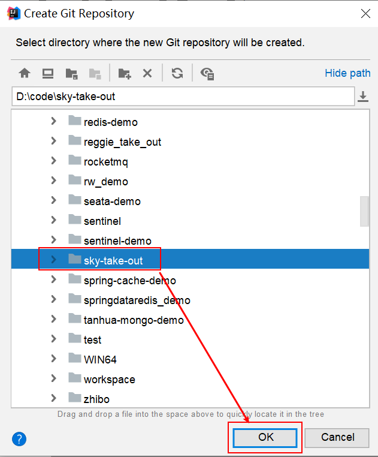

# FoodTech-skyBite-System

## Project Structure

- Software Development Overview
- skyBite Food Delivery Project Introduction
- Development Environment Setup
- Importing API Documentation
- Swagger


**Project Overall Effect Display: Project Overall Effect Display:**


When I complete this project, I developed the following abilities:

Learning Outcomes
1.	Gain development experience
2.	Improve business analysis skills
3.	Improve API (interface) design skills
4.	Improve coding skills
5.	Improve documentation reading skills
6.	Improve code debugging and testing skills

## 1. Software Development Overview

1. Software Development Overview
   As a software development engineer, we need to understand the development process, the roles involved in software development, role division of responsibilities, and the three software environments involved in software development. In this section, we will provide a general introduction to software development from three aspects: software development process, role division,
2. and software environments.


### 1.1 Software Development Process


**1). Phase 1: Requirements Analysis**

Complete the requirements specification document and product prototype.
Requirements specification document generally uses Word documents to describe each component of the current project, such as system definition, application environment, functional specifications, performance requirements, etc. For example:
Product prototype generally displays through web pages (HTML) showing what data the current page displays, what the page layout looks like, what page opens when clicking a certain menu, what effect appears when clicking a button. All can be seen through the product prototype. For example:
[Image: Product Prototype Example]


**2). Phase 2: Design**
Design content includes UI design, database design, and interface design.
UI Design: User interface design, mainly designing page effects, from a small button to a large page layout, and showing human-computer interaction logic. For example:


Database Design: Need to design which databases are involved in the current project, what tables each database contains, what relationships exist between these table structures, what fields the table structures contain. For example:

Interface Design: By analyzing prototype diagrams, first analyze coarse-grained how many interfaces each page has, then fine-grained analyze input parameters and return parameter values of each interface, and clearly define interface paths and request methods. For example:


**Phase 3: Coding**
Write project code and complete unit testing.
Project Code Writing: As software development engineers, we need to analyze module functions and implement them through coding.
Unit Testing: After coding implementation is complete, proceed with unit testing. Proceed to the next phase only after unit testing passes. For example:


**4). Phase 4: Testing**
In this phase, testers mainly perform functional testing on the project deployed in the test environment and produce test reports.

**5). Phase 5: Deployment and Maintenance**
Before the project goes online, operations personnel will prepare and configure the software environment on the server. After configuration is complete, 
deploy our developed project on the server to run.

### 1.2 Role Division

After familiarizing ourselves with the entire software development process, we also need to understand the roles involved in the entire software development process 
and the responsibilities of each role.


| Position/Role | Corresponding Phase | Responsibilities/Division |
| :--- | --- | :--- |
| Project Manager | All phases | Responsible for the entire project, task assignment, progress control |
| Product Manager | Requirements Analysis | Conduct requirement research, output requirement research documents, product prototypes, etc. |
| UI Designer | Design | Output interface effect diagrams based on product prototypes |
| Architect | Design | Overall project architecture design, technology selection, etc. |
| **Development Engineer** | **Coding** | **Functional code implementation** |
| Test Engineer | Testing | Write test cases, output test reports |
| Operations Engineer | Deployment and Maintenance | Software environment setup, project deployment |


The role division we've explained above is a fairly standard one in a project team, but in actual projects, some project teams may not have dedicated architects or testers due to personnel constraints, in which case project managers or programmers may need to take on multiple roles.

### 1.3 Software Environments

As software development engineers, we will inevitably encounter various software environments during the coding process. We will mainly analyze three environments commonly encountered at work: development environment, testing environment, and production environment. Next, we will introduce the functions and characteristics of these three environments.

**1). Development Environment (development)**

The environment we use as software developers during the development phase is the development environment, which is generally not accessible to external users.

For example, the MySQL database and other common software we use in development can be installed locally or on a dedicated server. These application software are only used during software development. During project testing and deployment, we will not use this environment anymore. This environment is the development environment.

**2). Testing Environment (testing)**

When software development engineers have completed the development of project functional modules and passed unit testing, the project needs to be deployed to a test server for testers to test. This test server is an environment specifically for testers, which is the testing environment, used for project testing and generally not accessible to external users.

**3). Production Environment (production)**

When the project development is completed and tested by testers, the project can be launched, deployed to the online environment, and formally provide services to the public. This online environment is also called the production environment.

*[Image: Three Environments Diagram - Development, Testing, Production]*

First, project development is carried out in the development environment, which is often a local computer environment and intranet environment. After development is completed, the project is deployed to the testing environment, which is generally an independent test server environment. After project testing passes, the project is finally deployed to the production environment, which can be a data center or cloud server, etc.


## 2. skyBite Food Delivery Project Introduction
Before developing the skyBite food delivery project, i organize this project comprehensively into this 3 aspects:
project introduction, product prototype, and technology selection.

### 2.1 Project Introduction

This project (skyBite Food Delivery) is a software product specifically customized for catering enterprises (restaurants, diners), including two parts: system management backend and mini-program application. The system management backend is mainly provided for internal staff of catering enterprises, allowing management and maintenance of restaurant categories, dishes, meal combos, orders, employees, etc., statistical analysis of various restaurant data, and voice announcement of incoming orders. The mini-program is mainly provided for consumers to browse dishes online, 
add to shopping cart, place orders, pay, and request order status.


Next, through the functional architecture diagram, will show the specific business functional modules of both **management end** and **user end**.


**1). Management End Functions**

Employee login/logout, employee information management, category management, dish management, combo management, dish flavor management, order management, 
data statistics, order notification.

**2). User End Functions**

WeChat login, recipient address management, user order history query, dish specification query, shopping cart functionality, 
ordering, payment, category and dish browsing.


### 2.2 Product Prototype

**产品原型**，用于展示项目的业务功能，一般由产品经理进行设计。

> **<font color='red'>注意事项：</font>** 产品原型主要用于展示项目的功能，并不是最终的页面效果。

**1). Management End**

Used by internal staff of catering enterprises. Main functions include:

| Module | Description |
| --- | --- |
| Login/Logout | Internal employees must log in before accessing the system management backend |
| Employee Management | Administrators can manage employee information in the system backend, including query, add, edit, disable, etc. |
| Category Management | Mainly manage and maintain the dish categories or combo categories of the current restaurant, including query, add, modify, delete, etc. |
| Dish Management | Mainly maintain dish information under each category, including query, add, modify, delete, enable, disable, etc. |
| Combo Management | Mainly maintain combo information in the current restaurant, including query, add, modify, delete, enable, disable, etc. |
| Order Management | Mainly maintain order information placed by users on the mobile end, including query, cancel, dispatch, complete, and order report download, etc. |
| Data Statistics | Mainly complete various data statistics of the restaurant, such as turnover, number of users, orders, etc. |


**2). User End**

Mobile applications are mainly provided for consumers. Main functions include:

| Module | Description |
| --- | --- |
| Login/Logout | Users need to log in through WeChat authorization to use the mini-program for ordering |
| Ordering-Menu | On the ordering interface, dish categories/combo categories need to be displayed, and based on the currently selected category, load the dish information for users to query and select |
| Ordering-Shopping Cart | Selected dishes are added to the user's shopping cart, mainly including query shopping cart, add to shopping cart, delete from shopping cart, clear shopping cart, etc. |
| Order Payment | After selecting dishes/combos, users can check out items in the shopping cart, which requires order payment |
| Personal Information | Basic information of the current user will be displayed on the personal center page, users can manage shipping addresses, and can also query historical order data |


### 2.3 Technology Selection

Regarding the technology selection for this project, we will introduce it from several aspects: user layer, gateway layer, application layer, and data layer, mainly to display the technology frameworks and middleware used in the project.


**1). User Layer**

In this project, when building the frontend pages of the system management backend, we will use H5, Vue.js, ElementUI, Apache ECharts (for displaying charts), etc. When building mobile applications, we will use WeChat Mini Program.

**2). Gateway Layer**

Nginx is a server mainly used as an Http server for deploying static resources with high access performance. Nginx has two other important functions: reverse proxy and load balancing. When deploying projects, Nginx can be used to achieve load balancing of Tomcat.

**3). Application Layer**

SpringBoot: Quickly build Spring projects, adopting the "convention over configuration" idea, simplifying Spring project configuration development.

SpringMVC: SpringMVC is a module of the Spring framework, springmvc and spring can be integrated seamlessly without an intermediate integration layer.

Spring Task: A scheduled task framework provided by Spring.

HttpClient: Mainly implements the sending of http requests.

Spring Cache: A data caching framework provided by Spring.

JWT: A token used to authenticate users on applications.

Alibaba Cloud OSS: Object Storage Service, mainly stores files such as images in the project.

Swagger: Can automatically help developers generate interface documents and test interfaces.

POI: Encapsulates common operations on Excel spreadsheets.

WebSocket: A communication network protocol that makes data exchange between client and server simpler, used for the implementation of order notification and order status query functions in the project.

**4). Data Layer**

MySQL: A relational database, the core business data of this project will be stored using MySQL.

Redis: An in-memory database based on key-value format storage, with fast access, often used as a cache.

MyBatis: The persistence layer in this project will use MyBatis development.

PageHelper: Pagination plugin.

Spring Data Redis: Simplifies the API of Java code operating Redis.

**5). Tools**

Git: Version control tool, used to manage project code in team collaboration.

Maven: Project build tool.

JUnit: Unit testing tool, after developers complete function implementation, they need to use JUnit for unit testing.

Postman: Interface testing tool, simulating various HTTP requests initiated by users and obtaining corresponding response results.


## 3. Development Environment Setup


Development environment setup mainly includes **frontend environment** and **backend environment** two parts. As server-side development engineers, the focus of our course learning should be on the backend business code. For the frontend pages, we only need to import the nginx from the materials, and we only need to be able to understand the frontend page code.

### 3.1 Frontend Environment Setup

**1). Frontend project based on nginx**

Find nginx for the frontend running environment from the materials and move it to a **non-Chinese directory**.


The **sky** directory contains the frontend resources for the management end, specifically as follows:


**2). Start nginx and access test**

Double-click nginx.exe to start the nginx service, access port number is 80

http://localhost:80


### 3.2 Backend Environment Setup

#### 3.2.1 Get Familiar with Project Structure

The backend project is built based on maven and is developed in modules.

**1). Find the backend initial project from today's materials:**


**2). Open the initial project with IDEA and understand the overall structure of the project:**


Description of each module's function in the project:

| **No.** | **Name** | **Description** |
| --- | --- | --- |
| 1 | sky-take-out | Maven parent project, uniformly managing dependency versions, aggregating other sub-modules |
| 2 | sky-common | Sub-module, storing common classes, e.g., utility classes, constant classes, exception classes, etc. |
| 3 | sky-pojo | Sub-module, storing entity classes, VO, DTO, etc. |
| 4 | sky-server | Sub-module, backend service, storing configuration files, Controller, Service, Mapper, etc. |

After understanding the overall structure of the project, let's analyze each sub-module in detail:

- **sky-common:** The module stores some common classes that can be used by other modules


  Analysis of the function of each package in the sky-common module:

  | Name | Description |
      | --- | --- |
  | constant | Store related constant classes |
  | context | Store context classes |
  | enumeration | Store project enumeration classes |
  | exception | Store custom exception classes |
  | json | Classes handling json conversion |
  | properties | Store SpringBoot related configuration property classes |
  | result | Encapsulation of return result classes |
  | utils | Common utility classes |

- **sky-pojo:** The module stores some entity, DTO, VO


  Analysis of the function of each package in the sky-pojo module:

  | **Name** | **Description** |
      | --- | --- |
  | Entity | Entities, usually corresponding to tables in the database |
  | DTO | Data Transfer Object, usually used for data transfer between layers in the program |
  | VO | View Object, object provided for frontend data display |
  | POJO | Plain Old Java Object, only has properties and corresponding getters and setters |

- **sky-server:** The module stores configuration files, configuration classes, interceptors, controllers, services, mappers, startup classes, etc.


  Analysis of the function of each package in the sky-server module:

  | Name | Description |
      | --- | --- |
  | config | Store configuration classes |
  | controller | Store controller classes |
  | interceptor | Store interceptor classes |
  | mapper | Store mapper interfaces |
  | service | Store service classes |
  | SkyApplication | Startup class |

#### 3.2.2 Git Version Control

Use Git for project code version control, specific operations:

**1). Create Git Local Repository**


When Idea shows:



It means the local repository is created successfully.

**2). Create Git Remote Repository**

**3). Push Local Files to Git Remote Repository**

1. **Commit files to local repository**

   Ignore the following types of files


2. **Add Git Remote Repository Address**

   Copy remote address:
   Add address:

3. **Push**

Successfully pushed to remote repository


#### 3.2.3 Database Environment Setup

1. **Find sky.sql from materials**

Directly open sky.sql file


Through this SQL file, you can directly create a database, so you don't need to create a database in advance, just import this file and execute it.

2. **Execute sky.sql file**

After execution, 11 tables are created in total


Description of each table:

| **No.** | **Table Name** | **Chinese Name** |
| --- | --- | --- |
| 1 | employee | Employee table |
| 2 | category | Category table |
| 3 | dish | Dish table |
| 4 | dish_flavor | Dish flavor table |
| 5 | setmeal | Combo table |
| 6 | setmeal_dish | Combo dish relation table |
| 7 | user | User table |
| 8 | address_book | Address table |
| 9 | shopping_cart | Shopping cart table |
| 10 | orders | Order table |
| 11 | order_detail | Order detail table |

For now, we'll just briefly understand what tables there are and what data each table stores. For specific table structures and fields in table structures, refer to the **"Database Design Document"** in the materials, and we'll also detail them when explaining specific function development.


#### 3.2.4 Frontend and Backend Integration Testing

The login function has already been implemented in the backend initial project, directly test the frontend and backend integration

Implementation idea:


**1. Controller Layer**

In the sky-server module, com.sky.controller.admin.EmployeeController

```java
/**
     * Login
     *
     * @param employeeLoginDTO
     * @return
     */
    @PostMapping("/login")
    public Result<EmployeeLoginVO> login(@RequestBody EmployeeLoginDTO employeeLoginDTO) {
        log.info("Employee login：{}", employeeLoginDTO);
        // Call service method to query database
        Employee employee = employeeService.login(employeeLoginDTO);

        // After successful login, generate jwt token
        Map<String, Object> claims = new HashMap<>();
        claims.put(JwtClaimsConstant.EMP_ID, employee.getId());
        String token = JwtUtil.createJWT(
                jwtProperties.getAdminSecretKey(),
                jwtProperties.getAdminTtl(),
                claims);

        EmployeeLoginVO employeeLoginVO = EmployeeLoginVO.builder()
                .id(employee.getId())
                .userName(employee.getUsername())
                .name(employee.getName())
                .token(token)
                .build();

        return Result.success(employeeLoginVO);
    }
```

**2. Service Layer**

In the sky-server module, com.sky.service.impl.EmployeeServiceImpl

```java
/**
     * Employee login
     *
     * @param employeeLoginDTO
     * @return
     */
    public Employee login(EmployeeLoginDTO employeeLoginDTO) {
        String username = employeeLoginDTO.getUsername();
        String password = employeeLoginDTO.getPassword();

        // 1. Query data from database based on username
        Employee employee = employeeMapper.getByUsername(username);

        // 2. Handle various exception situations (username doesn't exist, wrong password, account locked)
        if (employee == null) {
            // Account doesn't exist
            throw new AccountNotFoundException(MessageConstant.ACCOUNT_NOT_FOUND);
        }

        // Password comparison
        if (!password.equals(employee.getPassword())) {
            // Password error
            throw new PasswordErrorException(MessageConstant.PASSWORD_ERROR);
        }

        if (employee.getStatus() == StatusConstant.DISABLE) {
            // Account locked
            throw new AccountLockedException(MessageConstant.ACCOUNT_LOCKED);
        }

        // 3. Return entity object
        return employee;
    }
```

**3. Mapper Layer**

In the sky-server module, com.sky.mapper.EmployeeMapper

```java
package com.sky.mapper;

import com.sky.entity.Employee;
import org.apache.ibatis.annotations.Mapper;
import org.apache.ibatis.annotations.Select;

@Mapper
public interface EmployeeMapper {

    /**
     * Query employee by username
     * @param username
     * @return
     */
    @Select("select * from employee where username = #{username}")
    Employee getByUsername(String username);

}
```

Note: You can trace the execution process of the backend program through breakpoint debugging.

#### 3.2.5 Nginx Reverse Proxy and Load Balancing

After testing the login function, let's think about a question: **How are requests sent from the frontend routed to the backend service?**

Frontend request address: http://localhost/api/employee/login

Backend interface address: http://localhost:8080/admin/employee/login

**Frontend Request Address** vs **Backend Interface Address**


Obviously, the two addresses are inconsistent, so how are requests routed to the backend service?


**1). Nginx Reverse Proxy**

**Nginx Reverse Proxy** forwards dynamic requests sent from the frontend to the backend server


Why not directly request the backend server through the browser, why use nginx reverse proxy?

**Benefits of Nginx Reverse Proxy:**

- Improves access speed

  Because nginx itself can cache, if accessing the same interface and data caching is done, nginx can directly return the data without actually accessing the server, thus improving access speed.

- Performs load balancing

  Load balancing distributes a large number of requests to each server in the cluster in the manner we specify.

- Ensures backend service security

  Because backend service addresses are generally not exposed, they cannot be accessed directly with a browser. Nginx can be used as the entry point for request access, forwarding requests to specific services after they reach nginx, thus ensuring the security of backend services.


**Nginx Reverse Proxy Configuration Method:**

```nginx
server{
    listen 80;
    server_name localhost;
    
    location /api/{
        proxy_pass http://localhost:8080/admin/; #reverse proxy
    }
}
```

**proxy_pass:** This directive is used to set the address of the proxy server, which can be a hostname, IP address plus port number, etc.

The meaning of the above code is: Listen on port 80, then when we access an interface like http://localhost:80/api/...., it will reverse proxy to http://localhost:8080/admin/ through location /api/ {}.

Next, go to nginx-1.20.2\conf, open nginx configuration

```nginx
# Reverse proxy, handle requests sent from management end
location /api/ {
    proxy_pass   http://localhost:8080/admin/;
    #proxy_pass   http://webservers/admin/;
}
```

When accessing http://localhost/api/employee/login, nginx receives the request and redirects to http://localhost:8080/admin/, so the final request address is http://localhost:8080/admin/employee/login, which is consistent with the backend service access address.

**2). Nginx Load Balancing**

When services are deployed in a cluster, nginx needs to perform corresponding load balancing when forwarding requests to servers. In fact, load balancing is essentially based on reverse proxy, ultimately forwarding requests.

**Nginx Load Balancing Configuration Method:**

```nginx
upstream webservers{
    server 192.168.100.128:8080;
    server 192.168.100.129:8080;
}
server{
    listen 80;
    server_name localhost;
    
    location /api/{
        proxy_pass http://webservers/admin;#load balancing
    }
}
```

**upstream:** If the proxy server is a group of servers, we can use the upstream directive to configure the backend server group.

The meaning of the above code is: Listen on port 80, then when we access an interface like http://localhost:80/api/...., it will reverse proxy to http://webservers/admin, find a group of servers by the webservers name, and forward to a specific server according to the set load balancing strategy (default is round-robin).

**Note:** The name after upstream can be customized, but must be consistent across references.

**Nginx Load Balancing Strategies:**

| **Name** | **Description** |
| --- | --- |
| Round Robin | Default method |
| weight | Weight method, default is 1, the higher the weight, the more client requests are allocated |
| ip_hash | Based on IP allocation method, so each visitor can fixedly access a backend service |
| least_conn | Based on least connection method, prioritizing requests to backend services with fewer connections |
| url_hash | Based on URL allocation method, so the same URL will be allocated to the same backend service |
| fair | Based on response time method, services with shorter response times will be prioritized |

Specific Configuration Methods:

**Round Robin:**

```nginx
upstream webservers{
    server 192.168.100.128:8080;
    server 192.168.100.129:8080;
}
```

**weight:**

```nginx
upstream webservers{
    server 192.168.100.128:8080 weight=90;
    server 192.168.100.129:8080 weight=10;
}
```

**ip_hash:**

```nginx
upstream webservers{
    ip_hash;
    server 192.168.100.128:8080;
    server 192.168.100.129:8080;
}
```

**least_conn:**

```nginx
upstream webservers{
    least_conn;
    server 192.168.100.128:8080;
    server 192.168.100.129:8080;
}
```

**url_hash:**

```nginx
upstream webservers{
    hash &request_uri;
    server 192.168.100.128:8080;
    server 192.168.100.129:8080;
}
```

**fair:**

```nginx
upstream webservers{
    server 192.168.100.128:8080;
    server 192.168.100.129:8080;
    fair;
}
```

### 3.3 Improving Login Function

**Problem:** Passwords in the employee table are stored in plaintext, which has low security.


**Solution Approach:**

1. Store passwords after encryption to improve security

2. Use MD5 encryption method to encrypt plaintext passwords


**Implementation Steps:**

1. Modify plaintext passwords in the database to MD5 encrypted ciphertext

   Open employee table, modify password


2. Modify Java code, MD5 encrypt passwords submitted from frontend before comparing with database passwords

   Open EmployeeServiceImpl.java, modify password comparison

   ```java
   /**
        * Employee login
        *
        * @param employeeLoginDTO
        * @return
        */
       public Employee login(EmployeeLoginDTO employeeLoginDTO) {
   
           // 1. Query data based on username
          
           // 2. Handle various exception situations (username doesn't exist, wrong password, account locked)
           //...
           // Password comparison
           // TODO Later need to perform md5 encryption, then compare
           password = DigestUtils.md5DigestAsHex(password.getBytes());
           if (!password.equals(employee.getPassword())) {
               // Password error
               throw new PasswordErrorException(MessageConstant.PASSWORD_ERROR);
           }
   
           //...
   
           // 3. Return entity object
           return employee;
       }
   ```

## 4. Import API Documentation

Next, we will enter into project business development, and our development method is based on the current mainstream front-end and back-end separation development method in enterprises. This method requires us to define the interfaces first, so that front-end and back-end personnel can develop in parallel. Therefore, this chapter needs to import the interface documentation into the management platform to prepare for our subsequent business development. In fact, in real enterprise development, the interface design process is actually a very long process, which may require multiple meetings to discuss and adjust, and even during the development process, it may be found that some interface definitions still need to be adjusted. This situation is actually very common, but due to project time constraints, we choose to import all interfaces at once. During the development of business functions, we will also lead everyone to analyze how the corresponding interfaces are determined and why they are defined in this way, in order to cultivate students' interface design capabilities.

### 4.1 Front and Back End Separation Development Process

Step 1: Define interfaces, determine interface paths, request methods, input parameters, and return parameters.

Step 2: Front-end developers and back-end developers develop in parallel, and can also self-test.

Step 3: Front-end and back-end personnel conduct integration testing.

Step 4: Submit to testers for final testing.

### 4.2 Operation Steps

Import project interfaces provided in the course materials into YApi. Access address: http://yapi.smart-xwork.cn/

**1). Find the project interface file from materials**


**2). Import to YApi platform**

Create two projects on the YApi platform


Select skyBite Food Delivery-Management End Interface.json to import


Import successful


Perform the same operation for the user-end json file.

## 5. Swagger

### 5.1 Introduction

Swagger is a specification and complete framework for generating, describing, calling, and visualizing RESTful web services (https://swagger.io/). Its main functions are:

1. Makes front-end and back-end separation development more convenient, conducive to team collaboration

2. Interface documentation is automatically generated online, reducing the burden of back-end developers writing interface documentation

3. Function testing

   Spring has incorporated Swagger into its own standard, establishing the Spring-swagger project, now called Springfox. By introducing Springfox into the project, Swagger can be used very simply and quickly.

knife4j is an enhanced solution for integrating Swagger to generate Api documentation for Java MVC frameworks. It was formerly known as swagger-bootstrap-ui. The name knife4j hopes it can be like a dagger - small, lightweight, and powerful!

Currently, the knife4j framework is generally used.

### 5.2 Usage Steps

1. Import knife4j maven coordinates

   Add dependency in pom.xml

   ```xml
   <dependency>
      <groupId>com.github.xiaoymin</groupId>
      <artifactId>knife4j-spring-boot-starter</artifactId>
   </dependency>
   ```

2. Add knife4j related configuration in the configuration class

   WebMvcConfiguration.java

   ```java
   /**
        * Generate interface documentation through knife4j
        * @return
   */
       @Bean
       public Docket docket() {
           ApiInfo apiInfo = new ApiInfoBuilder()
                   .title("skyBite Food Delivery Project Interface Documentation")
                   .version("2.0")
                   .description("skyBite Food Delivery Project Interface Documentation")
                   .build();
           Docket docket = new Docket(DocumentationType.SWAGGER_2)
                   .apiInfo(apiInfo)
                   .select()
                   .apis(RequestHandlerSelectors.basePackage("com.sky.controller"))
                   .paths(PathSelectors.any())
                   .build();
           return docket;
       }
   ```

3. Set static resource mapping, otherwise, the interface documentation page cannot be accessed

   WebMvcConfiguration.java

   ```java
   /**
        * Set static resource mapping
        * @param registry
   */
   protected void addResourceHandlers(ResourceHandlerRegistry registry) {
           registry.addResourceHandler("/doc.html").addResourceLocations("classpath:/META-INF/resources/");
           registry.addResourceHandler("/webjars/**").addResourceLocations("classpath:/META-INF/resources/webjars/");
   }
   ```

4. Access test

   Interface documentation access path is http://ip:port/doc.html ---> http://localhost:8080/doc.html


   Interface testing: Test login function


**Think about it:** With Swagger generating interface documentation, do we no longer need Yapi?

1. Yapi is a tool used in the design phase to manage and maintain interfaces

2. Swagger is a framework used in the development phase to help back-end developers test back-end interfaces

### 5.3 Common Annotations

